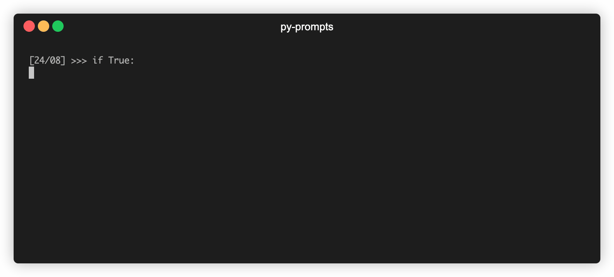

# py-prompts

Custom prompts for Python.



## Installing

```
$ curl -L https://raw.githubusercontent.com/Robert-96/py-prompts/main/install.sh | sh
```

## Quickstart

### List all prompts

```
$ py-prompts list
```

### Set a prompt

```
$ py-prompts set <prompt_name>
```

### Add custom prompt

Create a new python file in the `~/.py-prompts/prompts` directory.

You can use this example as a starting point:

```python
import sys


class CustomPromptPS1(object):

    def __str__(self):
        return ">>> "


class CustomPromptPS1(object):

    def __str__(self):
        return "... "


sys.ps1 = CustomPromptPS1()
sys.ps2 = CustomPromptPS1()

```

## License

This project is licensed under the [MIT License](LICENSE).
